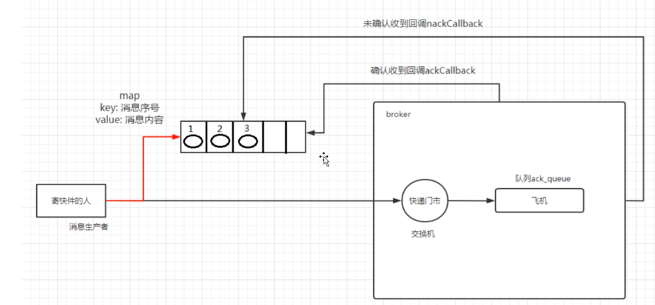

# Self-Learning RabbitMQ

主要是记录用来自己一步一步学习RabbitMQ的过程。

## MQ的基本概念
  - 流量削峰
  - 应用解耦
  - 异步处理

## MQ的种类
  - ActiveMQ
  - Kafka
  - RocketMQ
  - RabbitMQ

## RabbitMQ的四大核心概念
  - 生产者：产生消息
  - 交换机：可以和多个队列绑定
  - 队列：绑定的不同队列对应着不同的消费者或消费者组
  - 消费者：消费消息

## 其他概念
  - Broker：接受和分法消息实体，里面包含交换机和队列
  - Virtual Host：多租户和安全的场景下，把AMQP的基本组件划分到一个虚拟的分组中，类似于网络中的namespace的概念。
  - Connection：publisher/consumer和Broker之间创建的TCP连接。
  - Channel：每一个连接内部会创建一个逻辑连接，每一个进程的线程跟Channel进行连接
  - Exchange：message到底Broker的第一站，一个Exchange中对应着多个Queue。

## 工作队列模式
工作队列(又称为任务队列)的主要思想是避免立即执行资源密集型任务，而不得不等待它完成。相反我们安排任务在之后执行。我们把任务封装成为消息并将其发送到队列。在后台运行的工作进程将弹出任务并且最终执行作业，当有多个工作线程时，这些工作线程将一起处理这些任务。

## 消息应答
消费者完成一个任务可能需要一定的时间，如果其中一个消费者处理一个长的任务并仅只完成了部分突然它挂掉了，会发生什么情况？

**RabbitMq一旦向消费者传递了一条消息，便立刻将这条消息标记为删除。在这种情况下突然有个消费者挂掉了，我们将丢失正在处理的消息。以及后续发送给该消费者的消息都无法处理，因为它无法收到**

**为了保证消息在发送过程中不被丢失，rabbitmq引入消息应答机制**。消息应答就是：**消费者在接受到了消息并且处理消息之后，告诉rabbitmq它已经处理了，rabbitmq可以把这个消息删除了。**

### 自动应答机制
消息发送后立刻认为已经发送成功，这种模式需要在高吞吐量和数据传输安全性方面做权衡。

因为这种模式如果消息在被接受之前，消费者那边出现连接或者channel关闭，那么消息就丢失了。

当然另一方面这种模式下消费者那边可以接受到过载的信息，没有对传递的消息数量做限制。

有可能使得消费者这边由于接受太多没来得及处理的消息，导致这些消息的挤压，最终使得内存耗尽，最终这些消费者线程被操作系统杀死，所以这种模式仅仅适用于消费者可以高效并以某种速率能够处理这些消息的情况下使用。

### 手动应答的方式
A. Channel.basicAck 用于肯定确认 RabbitMq已知道该消息并且成功的处理消息，可以将其丢失了。

B. Channel.basicNack 用于否定确认

C. Channel.basicReject 用于否定确认，与Channel.BasicNack相比少一个参数，不处理该消息了直接拒绝，可以将其丢弃了。

**手动应答的好处:**
可以批量应答并且可以减少网络拥堵。

### 消息自动重新入队
如果消费者由于某种原因失去连接，连接关闭或者TCP连接丢失，导致消息未发送ACK确认，RabbitMQ将了解到消息未完全处理，并将对其重新排队。如果此时其他消费者可以处理，它将很快将其重新分发给另一个消费者。这样，即使一个消费者偶尔死亡，也可以确保不会丢失消息。

### 消息持久化
消息被消费失败我们可以通过重新入队的方式来保证不丢失。但是当RabbitMQ挂掉，我们可以使用消息持久化来保证消息不会丢失。主要是两件事：
**队列+消息都保证持久化**。

- 队列持久化：
之前我们创建的队列都不是持久化的，rabbitmq如果重启的话，该队列就会删除掉，如果要实现队列持久化需要在队列声明的时候把durable参数改为true。

**如果之前声明的队列不是持久化的话，需要把原来的队列删除，或者重新创建一个新的持久化队列，不然就会出现错误。**

创建的持久化队列在重启rabbitmq之后也还是存在。

- 消息持久化：
  要想让消息实现持久化需要在消费生产者修改代码，MessageProperties.PERSISTENT_TEXT_PLAIN添加这个属性。

将消息转换为持久化并不能完全保证不会丢失消息。尽管它告诉RabbitMQ把消息持久化到磁盘，但是这里依然存在当消息刚准备存储在磁盘的时候，但是还没有存储完，消息还在缓存的一个间隔点。此时并没有真正的写入磁盘。持久性保证并不强，但是对于简单队列而言，这已经绰绰有余了。

### 不公平分发
默认情况下rabbitmq采用的是轮询的方式分法，但是在大部分场景下这种策略不是很好。比如我们有两个消费者在处理任务时，其中一个消费者处理速度很快，另一个消费者处理速度很慢，这个时候我们还是采用轮询分法的方式就会到这处理速度快的这个消费者很大一部分时间是处于空闲状态的，而处理慢的消费者一直在干活，这种分配方式不是很好。

**为了避免这种情况，我们可以设置参数channel.basicQos(1);**

### 欲取值
多条消息的分法指定不同的消费者消费多少条消息。

这个预取值的方法是在channel上进行处理的，定义该通道上允许的未确认消息的最大数量，

我们可以设置参数channel.basicQos(2); 中间的数字是该channel的最大未确认消息数量。

## 发布确认
生产者将信道设置成 confirm 模式，一旦信道进入confirm模式，所有在该信道上面发布的消息都将会被指派一个唯一的ID(从1开始)，一旦消息被投递到所有匹配的队列之后，broker就会发送一个确认给生产者(包含消息的唯一 ID)，这就使得生产者知道消息已经正确到达目的队列了。

如果消息和队列是可持久化的，那么确认消息会在将消息写入磁盘之后发出，broker 回传给生产者的确认消息中 delivery-tag 域包含了确认消息的序列号，此外 broker 也可以设置basic.ack的 multiple 域，表示到这个序列号之前的所有消息都已经得到了处理。

confirm 模式最大的好处在于他是异步的，一旦发布一条消息，生产者应用程序就可以在等信道返回确认的同时继续发送下一条消息，当消息最终得到确认之后，生产者应用便可以通过回调方法来处理该确认消息，如果 RabbitMQ 因为自身内部错误导致消息丢失，就会发送一条 nack 消息，生产者应用程序同样可以在回调方法中处理该 nack 消息。
- 开启发布确认的方法
```java
channel.confirmSelect();
```
### 单个确认发布
- 它是一种同步确认发布的方式，也就是发布一个消息之后只有它被确认发布，后续的消息才能继续发布。
- 发布速度特别慢，因为如果没有确认发布的消息就会阻塞后面所有消息的发布，这种方式最多提供每秒不超过数百条发布消息的吞吐量。
```java
boolean flag = channel.waitForConfirms(long timeout);
// 等待单个消息确认，如果没没有被确认或者在超时内没有确认则会阻塞。
if(flag){
    System.out.println("消息发送成功");
}
```

### 批量确认发布
- 上面的方式非常慢，与单个等待确认消息相比，先发布一批消息然后一起确认可以极大地提高吞吐量。

当然这种方式的缺点就是：

**当发生故障导致发布出现问题时，不知道是哪个消息出现问题了。**
我们必须将整个批处理保存在内存中，以记录重要的信息而后重新发布消息。
```java
if(i % batchSize == 0){
    boolean flag = channel.waitForConfirms();
    if(flag){
        System.out.println("批量确认成功");
    }
}
```
### 异步确认发布
异步确认虽然编程逻辑比上两个复杂，但是性价比最高，无论是可靠性还是效率都没得说。它是利用回调函数来保证是否投递成功。

**如何处理异步未确认消息？**

可以添加一个监听器channel.addConfirmListener(ackCallback, nackCallback);需要实现ackCallback和nackCallback。

ackCallbak中可以添加一个ConcurrentSkipListMap来保证并发性，这里用来存放已经完成的消息序号，从而在ackCallback中的完成的消息被删除，留下没有被删除的。再对这些消息进行处理。

> 以上的发布速度对比:
>
> 1. 单独发布消息：同步等待确认，简单，但是吞吐量有限。
> 2. 批量发布消息：批量同步等待确认，简单，合理的吞吐量，一旦出现问题很难判断出来是哪条。
> 3. 异步处理：最佳性能和资源使用，在出现错误的情况下很好地控制。

```java
// 开启发布确认
        channel.confirmSelect();

        /*
        线程安全有序的表，适用于高并发的场景 --> 跳表
        1. 轻松的将序号与消息进行关联
        2. 轻松的批量删除已经确认的消息
        3. 支持高并发
         */
        ConcurrentSkipListMap<Long,String> outstandingConfirms = new ConcurrentSkipListMap<>();

        // 准备消息的监听器，监听哪些消息成功了，哪些消息失败了

        // 消息确认成功 回调函数
        ConfirmCallback ackCallback = (deliveryTag, multiple) -> {
            if(multiple){
                // 删除已经确认的消息，剩下的就是未确认的消息
                ConcurrentNavigableMap<Long, String> confirmed = outstandingConfirms.headMap(deliveryTag);
                confirmed.clear();
            }else{
                // 如果不是批量的，那就删除当前这个tag的消息
                outstandingConfirms.remove(deliveryTag);
            }
            System.out.println("消息" + deliveryTag + "发送成功");
        };
        // 消息确认失败 回调函数
        ConfirmCallback nackCallback = (deliveryTag, multiple) -> {
            String nackMessage = outstandingConfirms.get(deliveryTag);
            System.out.println("未确认的消息是:" + nackMessage);
            // 打印一下未确认的消息都有哪些
            System.out.println("消息" + deliveryTag + "发送失败");
        };
        channel.addConfirmListener(ackCallback, nackCallback);


        long begin = System.currentTimeMillis();
        // 批量发布，异步发布。
        for (int i = 0; i < MAX_COUNT; i++) {
            String message = "消息" + i;
            channel.basicPublish("", QUEUE_NAME, null, message.getBytes("UTF-8"));
            // 1.这里记录所有要发送的消息
            outstandingConfirms.put(channel.getNextPublishSeqNo(),message);
        }
        long end = System.currentTimeMillis();
        System.out.println("发布" + MAX_COUNT + "个消息，耗时" + (end - begin) + "ms");
    }
```